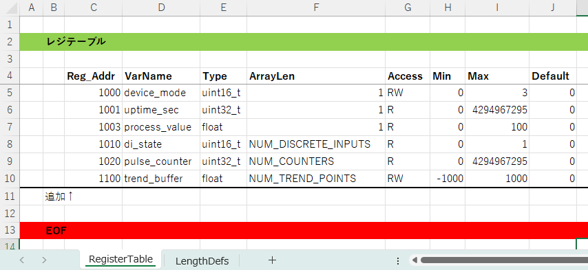
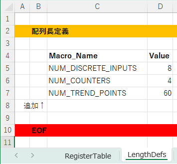
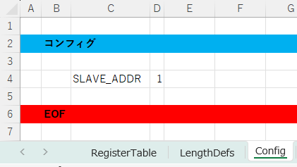

# modbus-master-regmap-generator

**modbus-master-regmap-generator** は，Modbus マスタ側のレジスタマップ仕様書（Excel）から，

- send/request フレーム生成用関数
- reply フレームの parse ＋値チェック処理
- レジスタアクセス用 getter/setter 関数
- ビット変化／値変化を検出するエッジ検出関数  
  （rising/falling/toggled など）

といった，Modbus 通信まわりの定型コード一式を自動生成するツールです。

## 1.なぜ作ったか

Modbus のレジマップやプロトコル部分は仕様書で厳密に決まっている一方で，
それを C コードとして手打ちすると，

- アドレスのずれ・サイズ指定ミス
- min/max 範囲の書き間違い
- 送受信フレームのバイト数計算ミス

といった「しょぼいヒューマンエラー」がどうしても紛れ込みます。

このツールでは，**レジマップの仕様書を唯一のソース・オブ・トゥルースにする**ことを目的にしています。  
レジマップを Excel 上で修正すれば，ソフトウェアエンジニアはコードを一行も触らずに

- レジスタ定義
- アクセッサ
- 送受信ハンドラ
- エッジ検出処理

を丸ごと再生成できます。  
プロトコルとして厳格に決まっている部分を自動生成に任せることで，  
エンジニアはアプリケーションロジックに集中し，思わぬミスを根本から減らすことを狙っています。

## 2.対象とする環境

本ツールは以下の環境で動作確認を行っています。

- **OS**: Windows 10 / 11（※ macOS / Linux でも Python と tkinter が動作すれば利用可能）
- **Python**: 3.10 〜 3.12
- **必要ライブラリ**
  - `pandas`
  - `openpyxl`
  - `tkinter`（GUI のファイル選択ダイアログに使用）
- **入力ファイル**: Excel（`.xlsx`）形式のレジスタ定義書  
- **出力**: C 言語（C89 相当）で実装された Modbus マスタ向けコード一式  

※ Modbus 通信の実装そのもの（UART/SPI/RS-485 のドライバ等）は対象外です。  
  あくまで「レジマップ → コード生成」に特化したツールです。

---

## 3.クイックスタート
### 3.1. EXE版を使う

#### 3.1.1. ダウンロード
Windows 向けの実行ファイル（exe）は  
GitHub Releases ページからダウンロードできます。

➡ **[Releases ページはこちら](https://github.com/prevalmam/modbus-master-regmap-generator/releases)**

最新バージョンの Assets から  
`modbus-master-regmap-generator.exe` をダウンロードしてください。

#### 3.1.2. SHA-256（検証用）

配布している実行ファイルの SHA-256 ハッシュ値は  
Releases の Assets に含まれる `SHA256SUMS.txt` に記載しています。

ダウンロード後、以下のコマンドで検証できます。
```powershell
certutil -hashfile modbus-master-regmap-generator.exe SHA256
```
出力されたハッシュ値が SHA256SUMS.txt に記載されている値と一致すれば、
ファイルが改ざんされていないことを確認できます。

### 3.2. ソースコードから使う

#### 3.2.1. git clone + pip install
次に示すコマンドを実行して，ソースコードをクローンし，pip でインストールします。

```powershell
git clone https://github.com/prevalmam/modbus-master-regmap-generator.git
cd modbus-master-regmap-generator
pip install .
```

### 3.2.使い方

1. Excel でレジスタ定義ファイルを準備します。
2. コマンドラインから以下を実行します。

```powershell
mmg
```
3. 起動後に Excel ファイルを選択するとExcel と同じフォルダに C/C ヘッダファイル群が出力されます。

## 4.生成コードの使い方

### 4.0 全体の流れ

生成されたコードは、以下のステップで使用します。

1. 送信ドライバ差し込み（`modbus_sender_output` 実装）
2. 初期化（エッジ検出関数の初期化）
3. 送信処理（read/write リクエストを送る）
4. 受信処理（応答フレームを受信し、パースし、RAM に反映する）
5. 値の参照・更新（getter/setter でアプリ側からアクセス）
6. エッジ検出（値の変化を検出し、アプリイベントとして処理）
---

### 4.1 送信ドライバ差し込み（`modbus_sender_output` 実装）

生成コード一式のうち、実機へフレームを吐き出す処理だけはユーザー側で書き足す必要があります。`modbus_sender_generic.c` 冒頭には次のような extern 宣言だけが置かれています。

```c
extern void modbus_sender_output(const uint8_t *data, uint16_t len);
```

この関数に UART / RS-485 / TCP など、実際の送信ドライバを呼び出すコードを実装してください。最低限の手順は以下のとおりです。

1. 生成物中から上記シグネチャのスタブ（もしくはヘッダ宣言）を探し、自プロジェクトの送信モジュールにコピーする。
2. TX イネーブルや CRC 追加など、物理層に必要な処理を行ったうえで `data` バッファを `len` バイト分送信する。
3. 送信完了待ちや半二重制御（DE/RE 制御）が必要な場合は、この関数内で完結させる。

参考までに、RS-485 ＋ DMA 送信を想定した最小実装例は以下です。

```c
void modbus_sender_output(const uint8_t *data, uint16_t len)
{
    rs485_set_tx_enable(true);
    uart_dma_send(data, len);
    uart_dma_wait_for_complete();
    rs485_set_tx_enable(false);
}
```

このフックを埋めておけば、以降の送信 API（read/write リクエスト）はすべて生成コードだけで完結します。

### 4.2 初期化

起動時に行うべき初期処理は次の 2 ステップに集約されます。

1. **RAM の実値を `g_reg_table_master` 経由でセットする** — FRAM/EEPROM/別ストレージからの復元あるいはデフォルト値の適用を、生成済み getter/setter ではなく `g_reg_table_master` の `ram_ptr` と `size` を使って一括処理するのが最も手軽でミスがありません。永続領域のデータがない場合は、`default_value` をコピーするだけで RAM が仕様書どおりに初期化されます。

    ```c
    static void load_reg_defaults(void)
    {
        for (uint16_t i = 0; i < g_reg_table_master_size; ++i)
        {
            const reg_table_master_entry_t *e = &g_reg_table_master[i];
            uint16_t elem_size = (uint16_t)(e->size / e->length);
            for (uint16_t j = 0; j < e->length; ++j)
            {
                const uint8_t *src = ((const uint8_t *)e->default_value) + (j * elem_size);
                uint8_t *dst = ((uint8_t *)e->ram_ptr) + (j * elem_size);
                (void)memcpy(dst, src, elem_size);
            }
        }
    }
    ```

2. **`modbus_reg_edge_master_init()` でエッジ検出のプリロードを行う** — 上記の RAM セット後にこの関数を 1 回呼ぶと、すべてのエッジ検出器が「現在値＝前回値」で同期され、初回ポーリング時の誤検知を防げます。以降は周期タスクや受信ハンドラから各 `detect_*` 関数をそのまま利用できます。

```c
void app_init(void)
{
    load_reg_defaults();          /* RAM に初期値を展開 */
    modbus_reg_edge_master_init(); /* エッジ検出の前回値をプリロード */
}
```

その他の生成ファイル（reg_map/access/sender/reply_handler 等）は静的データや純粋関数のみで構成されているため、追加の初期化は不要です。

### 4.3 送信処理（Request の送信）

生成コード側では、各レジスタブロックごとに **read 系 (`modbus_sender_req_*`)** と **write 系 (`modbus_sender_set_*`)** の 2 本立て API が自動生成されます。`MODBUS_SLAVE_ADDR` は Excel の Config シートから取得され、すべての送信フレームに自動で組み込まれます。

#### 4.3.1 Read Request（0x03）

- 監視したいブロックに対して `modbus_sender_req_<VarName>()` を呼び出すだけで、Function Code 0x03 のフレームが生成されます。
- 送信バッファは `modbus_sender_output()` へそのまま受け渡されるため、ユーザーは UART／RS-485 ドライバ内で実際の TX を完了させます。

```c
void poll_uptime_sec(void)
{
    modbus_sender_req_uptime_sec();         /* Excel で定義した block 名に応じた関数名が生成される */
}
```

#### 4.3.2 Write Request（0x10）

- アプリ側で RAM 上の値を setter で更新したあと、`modbus_sender_set_<VarName>()` を呼び出すと Function Code 0x10（Write Multiple Registers）が組み立てられます。
- データ型ごとに `modbus_sender_generic_u16/u32/float()` が内部で選択され、必要なバイト長や配列展開をすべて自動で行います。
- 配列レジスタの場合もブロック全体を 1 パケットで送るのが基本です。

```c
void update_device_mode(uint16_t new_value)
{
    set_device_mode(new_value);             /* RAM を最新値で更新 */
    modbus_sender_set_device_mode();        /* 直近ブロックを丸ごと 0x10 で送信 */
}
```

---

### 4.4 受信処理とパース

応答フレームを受信したら、reply_handler に渡すだけで完了します。

    if (rx_complete) {
        modbus_reply_handler_master(rx_buf, rx_len);
    }

パース後に自動的に行われる処理：

- CRC の検証
- Function Code の判定
- レジスタ値の展開
- Min/Max チェック
- RAM（g_reg_table_master[]）への反映

---

### 4.5 レジスタアクセス（getter / setter）

#### 4.5.1 値の読み出し（getter）

    uint16_t mode = get_device_mode();
    float process_value = get_process_value();

#### 4.5.2 値の書き換え（setter）

    set_device_mode(2);
    set_process_value(36.5f);

なお、setter は min/max チェックを自動で行います。 範囲外の値をセットしようとした場合は何も変更されません。

#### 4.5.3 下限値・上限値の取得

    uint16_t min_mode = get_device_mode_min();
    uint16_t max_mode = get_device_mode_max();
---

### 4.6 エッジ検出（値変化の検知）

#### 4.6.1 立ち上がり検出の例（単体値）

```c
    if (detect_device_mode_rising(0xffff)) {
        // 0 → 1 に変化したときだけ実行
    }
```

特定のビットマスクを指定することも可能：

#### 4.6.2 立ち下がり検出の例（単体値）

```c
    if (detect_device_mode_falling(0xffff)) {
        // 1 → 0 に変化したときだけ実行
    }
```

#### 4.6.3 トグル検出の例（配列値）

```c
    if (detect_discrete_inputs_toggled(0x0003)) {
        // ビット 0 またはビット 1 が変化したときだけ実行
    }
```


## 5.詳細仕様

### 5.1.入力 Excel のフォーマット概要

本ツールは、次のような構造のレジスタ定義書（Excel）を前提としています。

#### 5.1.1.RegisterTable シート

| 列名 | 例 | 説明 |
|------|------------|-------------------------------------------|
| `Reg_Addr` | `1000` | Modbus アドレス(10進数) |
| `VarName` | `device_mode` | レジスタの論理名（C 変数名にも使用） |
| `Type` | `uint16_t` / `uint32_t` / `float` | 型（C コード生成に利用） |
| `ArrayLen` | `1` / `NUM_DISCRETE_INPUTS` | 配列長。複数の場合は連続アドレスを自動展開 |
| `Min` | `0` | 許容最小値（境界チェックで使用） |
| `Max` | `3` | 許容最大値（境界チェックで使用） |
| `Default` | `0` | 初期値 |



※プロジェクトに応じて追加カラムは自由に拡張できます。  

#### 5.1.2LengthDefs シート（任意）

| 列名 | 説明 |
|------|-------------------------------------------|
| `Macro_Name` | ArrayLen のマクロ名 |
| `Value` | マクロの値 |



※プロジェクトに応じて追加カラムは自由に拡張できます。  

#### 5.1.3.Config シート

D4セルに Modbus スレーブアドレス（10進数）を指定します。



---

### 5.2.生成されるファイル一覧

本ツール実行後、選択した Excel と同じフォルダに以下の C/C ヘッダファイル群が出力されます。

#### 5.2.1.レジスタ定義・アクセサ
| ファイル | 役割 |
|---------|--------------------------------------------|
| `modbus_reg_map_master.c/h` | レジスタのメタ情報テーブル（型、アドレス、Min/Max/Default、RAM 参照など） |
| `modbus_reg_idx_master.h` | `MODBUS_IDX_***` マクロで各レジスタのインデックスを一元管理 |
| `modbus_reg_access_master.c/h` | getter / setter / min-max 取得関数、およびビットマスク付き setter |

#### 5.2.2.エッジ検出

| ファイル | 役割 |
|---------|--------------------------------------------|
| `modbus_reg_edge_master.c/h` | 単体値・配列値どちらにも対応した変化検出（rising / falling / toggled / changed）関数群 |

#### 5.2.3.受信処理

| ファイル | 役割 |
|---------|--------------------------------------------|
| `modbus_reply_handler_master.c/h` | Read Holding Registers 応答の CRC 検証、値取り出し、レンジチェック、RAM 更新 |

#### 5.2.4.送信処理

| ファイル | 役割 |
|---------|--------------------------------------------|
| `modbus_sender_gen.c/h` | 各レジスタブロックごとの read request / write set ラッパー、直近リード範囲の保持 |
| `modbus_sender_generic.c/h` | write multiple registers 用の型別共通送信関数（uint16/uint32/float） |

#### 5.2.5.共通ユーティリティ

| ファイル | 役割 |
|---------|--------------------------------------------|
| `modbus_crc_util.c/h` | Modbus CRC16 の付与・計算ユーティリティ |
